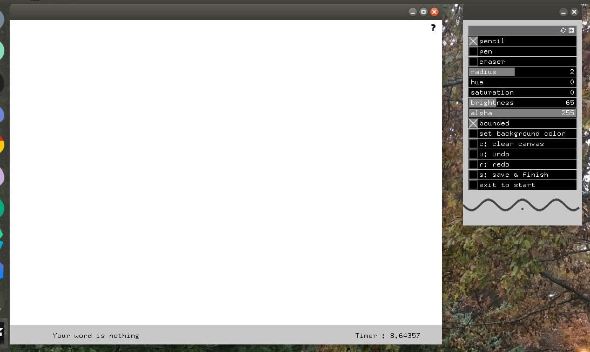

# CS 126 FinalProject <br />
For my final project, I have created a drawing application. This app allows you to adjust settings such as tool type, color, size, and more. There are two modes: timed and free. Free is a blank canvas on which you can draw anything you'd like. Timed will generate a random noun for you to draw, and will have a timer to track how long you take to draw the randomly generated word. In either mode, you will find a help button (?) in the upper right hand corner that will give more details on using the app. Note that saving an image will save the file to the directory bin/savedimages with a unique filename. <br />
## Installation and Deployment <br />
First, you will need to download [OpenFrameworks](http://openframeworks.cc/download/) <br />
Once you have that, download this repository and move it to the directory OF/apps/myApps/ <br />
Using the project generator, import this project folder and click update. <br />
Now you should be able to run the application from the command-line. <br />
```
$ cd {path to project}
$ make
$ makeRunRelease
```
## Screenshots <br />
#### Home Screen: <br />
 <br />
#### Free Draw: <br />
 <br />
#### Timed Draw: <br />

